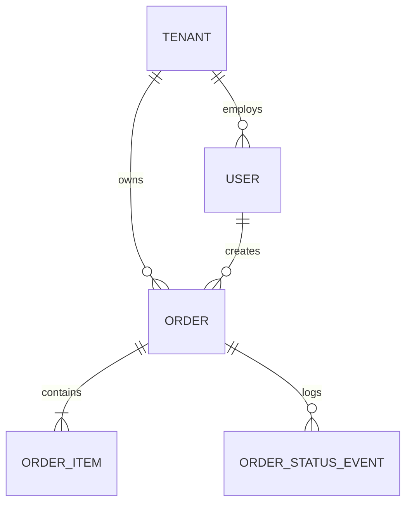
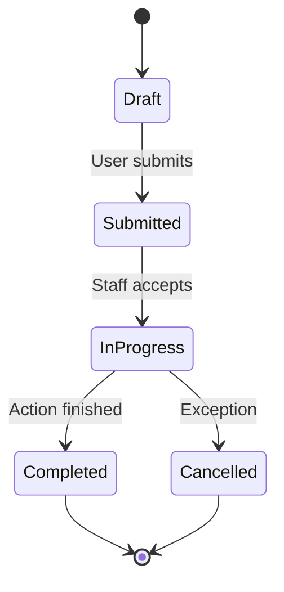

# [Project Name] - Product Requirements Document (PRD)

> **Instructions for Developers & Product Managers**:  
> This file is a standardized, production-grade PRD template designed for applications bootstrapped from the **Laravel + Livewire Starter Template**.  
> When starting a new project, copy or replace the bracketed placeholders (`[Project Name]`, `[Feature]`, etc.) with your specific project requirements. Keep the structure intact to ensure consistency across architecture, security, and quality standards.

---

**Document Status**: Draft / In Review / Approved / Active  
**Product Owner**: [Name / Team]  
**Lead Engineer**: [Name / Team]  
**Target Release Date**: [YYYY-MM-DD]  
**Last Updated**: [YYYY-MM-DD]  
**Version**: 1.0.0  

---

## 1. Product Summary

### 1.1 Executive Summary
[Provide a concise 2-3 paragraph summary of what the product does, who it serves, and what core problem it solves.]

### 1.2 Problem Statement
- **Current Pain Points**: [What difficulties do users or businesses face without this application?]
- **Impact**: [What is the operational or financial cost of this problem?]

### 1.3 Proposed Solution
- [How does this application solve the problem through automation, real-time reactive UI (Livewire), or streamlined operational workflows?]

### 1.4 Architecture & Deployment Context
- **Stack**: Laravel 13, Livewire 4, Flux UI, Folio file-based routing, Tailwind CSS v4, PHP 8.4.
- **Database**: SQLite (Local Dev / Testing) / MySQL or PostgreSQL (Production).
- **Hosting Target**: Laravel Cloud, Forge, or containerized Docker / Sail deployment.

---

## 2. Goals & Non-Goals

### 2.1 Business Goals
- [e.g., Reduce turnaround time for processing customer orders by 50%.]
- [e.g., Enable single-pane-of-glass management for multiple operational branches.]
- [e.g., Achieve 99.9% uptime with automated audit logging for all privileged actions.]

### 2.2 Technical Goals
- Strict type safety with PHP 8.4 and strict types declared across all domain code.
- 100% test coverage for critical business logic using Pest 5.
- Sub-100ms response times on reactive Livewire components using server-side optimizations.
- Accessible, responsive UI compliant with WCAG 2.2 AA standards.

### 2.3 Non-Goals (Out of Scope for Initial Launch)
- [List features that are explicitly deferred to later phases to avoid scope creep.]
- [e.g., Native iOS/Android apps (PWA / Mobile-responsive web only for Phase 1).]
- [e.g., Multi-currency support (IDR only for initial launch).]

---

## 3. Personas & User Roles

| Role | Access Level | Description | Key Workflows |
| --- | --- | --- | --- |
| **Superadmin** | Global Platform | Full system authority; manages tenants, platform settings, audit logs, and system health. | Pulse monitoring, system logs, master catalogs. |
| **Admin / Owner** | Organization / Tenant | Manages organization data, staff accounts, reports, and configurations. | Staff management, operational analytics, catalog updates. |
| **Staff / Operator** | Branch / Operational | Executes daily operational tasks (order entry, workflow processing). | Counter order entry, processing transitions, receipts. |
| **Customer** | Self / Account | Places requests, views active orders, updates personal profile. | Booking, real-time status tracking, digital receipts. |

---

## 4. Core Domain & Data Model

### 4.1 Entities & Relationships

### 4.2 Entity Definitions
- **Tenant / Organization**: [The root isolation boundary for multi-tenant applications.]
- **User**: [Global identity with credentials, profile information, and role assignments via Spatie Permission.]
- **[Core Entity, e.g., Order]**: [The primary transactional entity in the system, its lifecycle and invariants.]
- **[Secondary Entity, e.g., Item / Catalog]**: [Master data or line items attached to transactions.]
- **Activity Log**: [Immutable audit history recorded via Spatie Activitylog.]

### 4.3 Data Integrity & Financial Invariants
- Monetary values must be stored as integer subunits (e.g., integer Rupiah or cents) — never floating-point numbers.
- Transaction snapshots: Catalogs and pricing rules must be snapshotted at time of creation to prevent historical distortions.

---

## 5. Identity & Entry Flow

### 5.1 Authentication Matrix
- **Staff / Admin Entry**: Email and password via Fortify (`/login`). Optional passkeys / 2FA.
- **Customer Entry**: Normalized WhatsApp phone number + PIN or Magic Link.
- **Session Lifecycle**: Invalidation on credential reset; maximum session timeout configuration.

### 5.2 Redirect Rules
- Guest users accessing `/` are redirected or shown the public landing page.
- Authenticated users redirect based on role:
  - Superadmin & Admin -> `/cms/dashboard`
  - Operational Staff -> `/app` or `/cms`
  - Customer -> `/app` or customer portal

---

## 6. Functional Specifications

### 6.1 Module A: [e.g., Transaction Management]
- **Requirement 1**: [User can create new record with validation rules.]
- **Requirement 2**: [Real-time calculation of totals via Livewire 4 reactivity.]
- **Validation Rules**:
  - `name`: Required, max 255 chars.
  - `status`: Enum value, must match lifecycle transition table.
- **Edge Cases**:
  - Handling concurrent submissions (idempotency keys or database row locks).

### 6.2 Module B: [e.g., Workflow State Machine]

### 6.3 Module C: [e.g., Reporting & Exports]
- Filtered metrics: Date ranges, branch selection, status filter.
- Summary KPI cards: Total volume, average turnaround, cancellation rate.
- CSV / Excel export: Streaming responses formatted with UTF-8 BOM for Excel compatibility.

---

## 7. UI / UX & Flow Architecture

### 7.1 Layout Strategy (Matching HydroBento Precision System)
- **CMS Shell & Bento Layout**: Structured modular bento grid (`7:5` and `8:4` column ratios), deep navy slate sidebar (`#161c28`), inverted telemetry hero cards, Space Grotesk display typography, and Hanken Grotesk body typography.
- **Card Enclosures & Geometry**: `1.5rem` (`rounded-3xl`) bento units, hairline 1px architectural borders (`#e2e8ed` on light / `#222c3d` on dark), and pill buttons (`rounded-full`).
- **Mobile Responsive**: Off-canvas drawer navigation for screens < 1024px, 44px minimum touch targets, dynamic 2-column mobile telemetry chips.
- **Flux UI Components**: Consistent pill buttons (`variant="primary"`, `variant="subtle"`), inputs (`rounded-xl`), selects, modals, and toast notifications.

### 7.2 Page Hierarchy & Folio Routes
| URL Path | Folio View Path | Middleware | Description |
| --- | --- | --- | --- |
| `/` | `resources/views/pages/index.blade.php` | `guest` | Public landing or redirect |
| `/login` | `resources/views/pages/auth/login.blade.php` | `guest` | Authentication shell |
| `/cms/dashboard` | `resources/views/pages/cms/dashboard.blade.php` | `auth, role:admin` | Executive Overview |
| `/cms/management/user` | `resources/views/pages/cms/management/user.blade.php` | `auth, permission:...`| User RBAC Table |

---

## 8. Non-Functional Requirements

### 8.1 Architectural Patterns (Mandatory)
- **DTOs**: Typed Data Transfer Objects for complex form data and action parameters.
- **Action Classes**: Single-responsibility backend use cases under `app/Actions/`.
- **Form Requests**: Dedicated validation request classes.
- **Strict Types**: `declare(strict_types=1);` in all PHP classes.

### 8.2 Testing Contract
- All new features must include Pest 5 feature tests (`php artisan make:test --pest {NameTest}`).
- Regression tests must cover happy paths, validation errors, and authorization boundaries.
- Continuous testing with Pest TIA: `vendor/bin/pest --tia`.

### 8.3 Accessibility & Performance
- Compliant with **WCAG 2.2 AA** (contrast ratio ≥ 4.5:1, keyboard focusable controls).
- Eager-loading on all Eloquent relationships to eliminate N+1 query bottlenecks.
- Background jobs for external APIs, notifications, or heavy exports.

---

## 9. Phased Implementation Roadmap

### Phase 1: MVP Core Operations
- [ ] Database migrations, factories, and seeders.
- [ ] Authentication & Role-Based Access Control (RBAC).
- [ ] Core transaction CRUD and Livewire interactive interfaces.
- [ ] Full Pest test suite passing with Pint formatting.

### Phase 2: Operational Workflows & Reporting
- [ ] State transition workflows with activity logging.
- [ ] Analytical dashboard metrics and KPI calculations.
- [ ] Export functionality (CSV / PDF).

### Phase 3: Advanced Capabilities
- [ ] External service integrations (WhatsApp notifications, Payment gateway).
- [ ] Performance caching and Laravel Pulse optimization.

---

## 10. Change Log & Revision History

| Date | Version | Author | Summary of Changes |
| --- | --- | --- | --- |
| 2026-09-18 | 1.0.0 | System | Initial baseline template created for Laravel + Livewire Starter Kit. |
